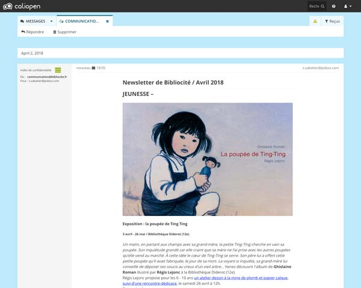

# Caliopen Messaging Platform

> The best way to discuss with your contacts, while preserving your privacy.

This repository hosts all the source code, the scripts and the tools for the
[CaliOpen](https://caliopen.org) project.

## Features requests, Issues, Pull Requests or share the love

Tell us whatever you want:
* our discourse: [feedback](https://feedback.caliopen.org/)
* Twitter [@caliopen_org](https://twitter.com/caliopen_org)
* IRC on [Freenode #caliopen](irc://chat.freenode.net:6697/caliopen).

**Some usefull links for developers:**

* Global documentation on [readthedocs](http://caliopen.readthedocs.io/en/latest/)
* Some contributing resources: [CONTRIBUTING.md](CONTRIBUTING.md)

## Installation

Unfortunately Caliopen is not yet ready for production.

Please refer to [production documentation](doc/production).
