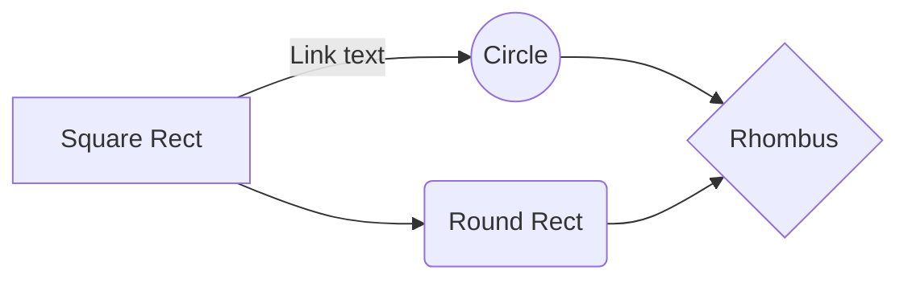
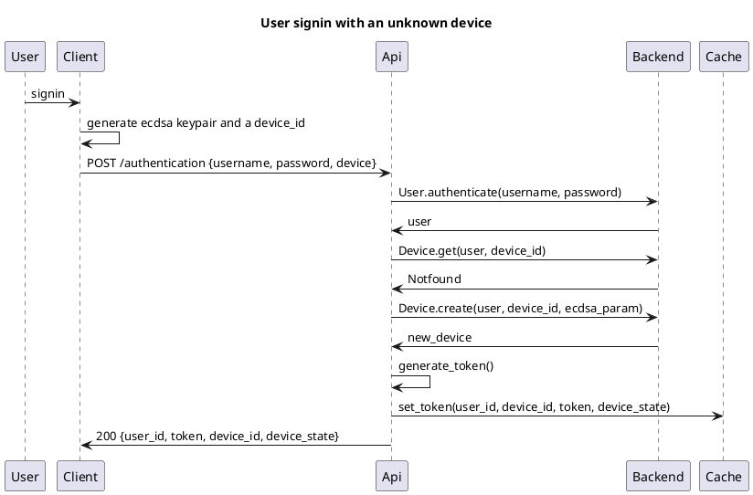

# Caliopen Documentation

This directory group all technical documentation related to Caliopen project.

## Content

 * [RFCs](RFCs/) acting as specification we defined for many parts of the project, and we will contiune too
 * [Automatic ReST API](api). A swagger 2.0 full definition for automatic API description and interactions
 * [Documentation for developers](for-developers). Guidelines, repository structure for the moment
 * [Dedicated python pyramid package, for swagger api plugin](py.doc)

More to come


## Tmp

One block code in js:

```js
const foo = 'bar';

const bar = () => 'hello world';
```

One block code in mermaid:




