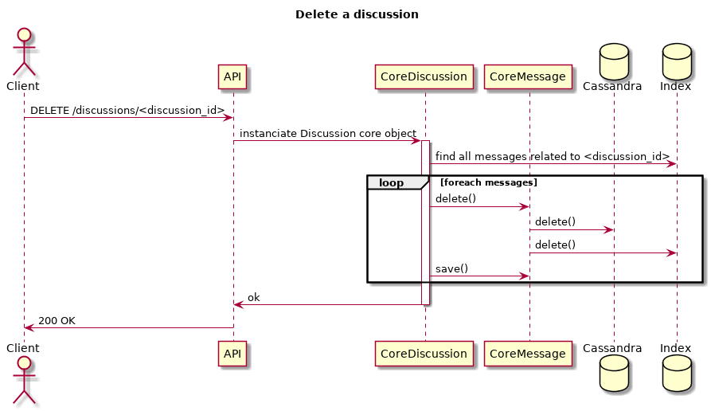

Delete discussion technical specification
=========================================

Synopsis
--------

API receive a DELETE /discussions/<discussion_id> HTTP request.

API is not responsible of the business logic, it only handle a message and
call an object that will execute the logic (a `core` object).

The core object will retrieve all messages that belong to the given `discussion_id` (core method filter(...) can do that). For each retrieved message, Message.date_delete is set to now() (UTC timezone) adn then message saved. The core method `Message.save()` will propagate changes on cassandra and elasticsearch.

The Discussion.date_delete parameter is set to same date as message.

So our objects (message and discussion) are not really deleted from our storages services, they are only flagged as it with a timestamp information. All interfaces to retrieve these objects filter automatically with a date_delete = NULL. 

This is called a `soft delete` principle. Objects will be really deleted later (many days or months later) by a dedicated process.

The API return an HTTP status 200 if everything is fine.

Things to do
------------

- Define the swagger specification for DELETE /discussions/<discussion_id> route
- Create a `Discussion.delete()` method on class `caliopen_main.discussion.core`
- Implement the API in `caliopen_api.discussion` python package

What part of code to consider
-----------------------------

- src/backend/interfaces/REST/py.server for the apiv1 server
- src/backend/main/py.main/caliopen_main for the core objects
- src/backend/defs/rest-api for the swagger definition, 
- devtools/gen-swagger-spec.sh for generating the src/backend/configs/swagger.json global file loaded by API servers

An important design note
------------------------

For an huge discussions the global response time for such DELETE action will take many seconds (at least). The natural evolution for this process will be to run asynchronous and emit a notification to client when it's done.

This is where the message queuing service (nats) is used, to do asynchronous processing.

- API receive the delete action and do basic check (discussion exist and not yet deleted, ...)
- API publish a message to nats and reply HTTP 202 immediatly

[..]

- nats worker receive a message to delete a discussion, the core Discussion object is instanciated and then delete() method call.
- nats emit a notification when processing is done.