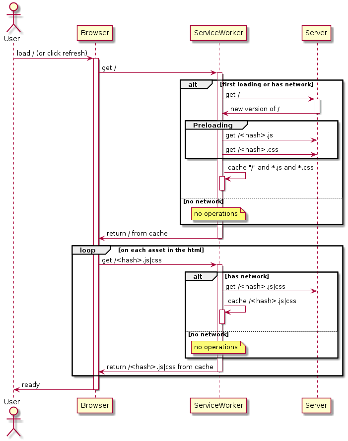

# Progressive Web App

Caliopen is a PWA, this means it can be «installed» on a device (smartphone or desktop) as a web application.

## Features

It can be installed on android via a browser like brave, chrome, firefox … or on desktop (for now, only chrom·e·ium support PWA).

how to: [https://feedback.caliopen.org/t/installer-lapplication-mobile/709]() [fr]

This is enabled because it provides a manifest file and at least a service worker.

The manifest is generated by [webpack-pwa-manifest](https://github.com/arthurbergmz/webpack-pwa-manifest).

And the service worker is generated by [offline-plugin](https://github.com/NekR/offline-plugin). This plugin uses webpack generated files list to allow the service worker to preload assets and make available offline.

_**/!\\** For now only assets can be cached but Caliopen requires `/api/v1/me` and `/api/v1/settings` to be half available offline : the read only mode.
And to be completely available offline, it requires a system that allows to queue user actions like saving or sending messages._

## Client upgrade sequence

