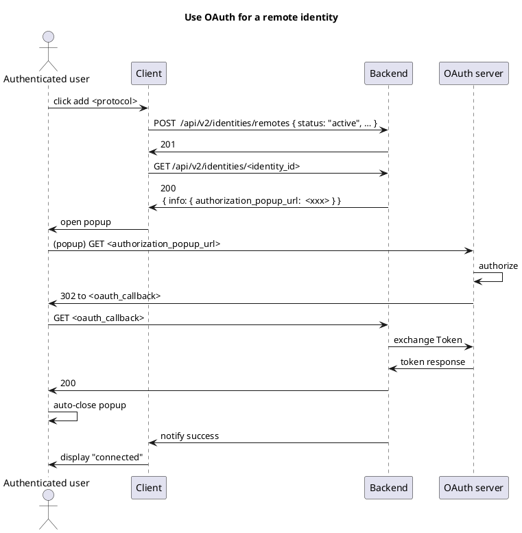

# OAuth 2.0 protocol

**TODO:** _drop puml_

```puml
@startuml
title Use OAuth for a remote identity
actor "Authenticated user" as user
participant "Client" as client
participant "Backend" as backend
participant "OAuth server" as oauth

user -> client: click add <protocol>
client -> backend: POST  /api/v2/identities/remotes { status: "active", … }

backend -> client: 201

client -> backend: GET /api/v2/identities/<identity_id>
backend -> client: 200\n { info: { authorization_popup_url:  <xxx> } }

client -> user: open popup
user -> oauth: (popup) GET <authorization_popup_url>

oauth -> oauth: authorize

oauth -> user: 302 to <oauth_callback>
user -> backend: GET <oauth_callback>

backend -> oauth: exchange Token
oauth -> backend: token response
backend -> user: 200
user -> user: auto-close popup

backend -> client: notify success
client -> user: display "connected"
@enduml
```
