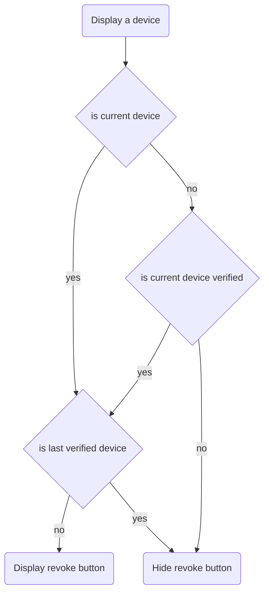
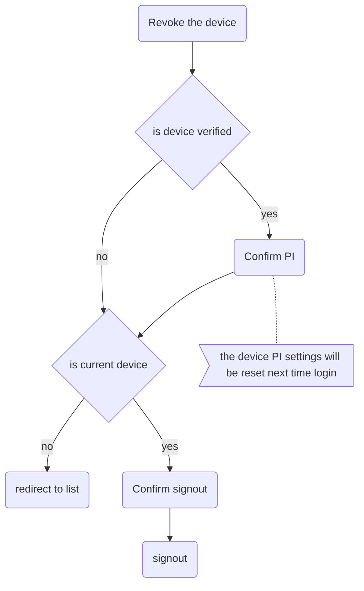

# Revoke devices

## Client

**Display revoke button**

```mermaid
graph TD
  start(Display a device)
  is_current{is current device}
  is_verified{is current device verified}
  is_last_verified{is last verified device}
  start-->is_current
  is_current -- yes --> is_last_verified
  is_current -- no --> is_verified
  is_last_verified -- no --> display
  is_last_verified -- yes --> hide
  is_verified -- yes --> is_last_verified
  is_verified -- no --> hide

  display(Display revoke button)
  hide(Hide revoke button)
```

**Handle revoke device**

```mermaid
graph TD
  start(Revoke the device)
  is_current{is current device}
  is_verified{is device verified}
  start --> is_verified
  is_verified -- yes --> confirm_PI
  is_verified -- no --> is_current
  confirm_PI -.- confirm_PI_text
  confirm_PI --> is_current
  is_current -- no --> redirect
  is_current -- yes --> confirm_signout
  confirm_signout --> signout

  confirm_PI(Confirm PI)
  confirm_PI_text>the device PI settings will be reset next time login]
  confirm_signout(Confirm signout)
  redirect(redirect to list)
  signout(signout)
```
